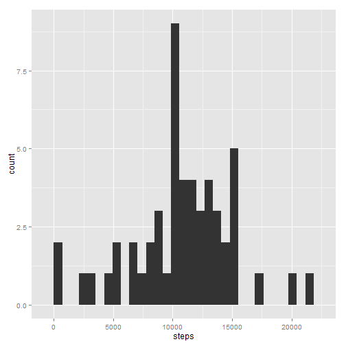
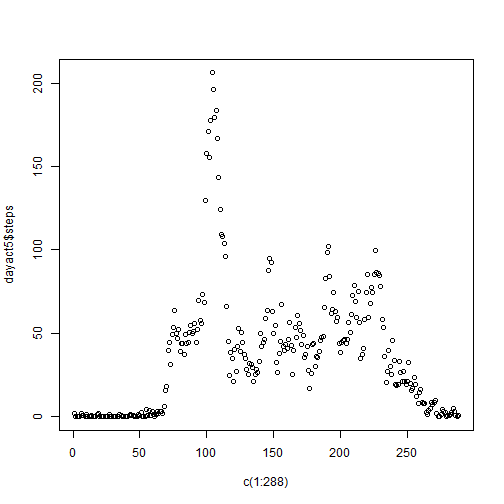

# Reproducible Research: Peer Assessment 1
============================


## Loading and preprocessing the data


```r
library(reshape2)
library(ggplot2)
library(lattice)
act <- read.csv("activity.csv")
```


## What is mean total number of steps taken per day?


```r
dayact <- melt(act[ , c(1, 2)], id.vars = "date", na.rm = TRUE)
dayact2 <- dcast(dayact, date ~ variable, fun.aggregate = sum)
qplot(steps, data = dayact2)
```

```
## stat_bin: binwidth defaulted to range/30. Use 'binwidth = x' to adjust this.
```

 

```r
print("mean:")
```

```
## [1] "mean:"
```

```r
mean(dayact2$steps)
```

```
## [1] 10766
```

```r
print("median")
```

```
## [1] "median"
```

```r
median(dayact2$steps)
```

```
## [1] 10765
```

## What is the average daily activity pattern?

```r
dayact4 <- melt(act[ , c(1,3)], id.vars = "interval", na.rm = TRUE)
dayact5 <- dcast(dayact4, interval ~ variable, fun.aggregate = mean)

plot(c(1:288), dayact5$steps, type = "p")
```

 

```r
print("interval that contains most average steps:")
```

```
## [1] "interval that contains most average steps:"
```

```r
print(dayact5[dayact5$steps == max(dayact5$steps), "interval"])
```

```
## [1] 835
```


## Imputing missing values

```r
numNA <- nrow(act)- nrow(dayact)
print(paste("number of NAs:", numNA))
```

```
## [1] "number of NAs: 2304"
```

```r
act1 <- act

print("The strategy for missing values is to replace them with the mean for that specific 5-minute interval")
```

```
## [1] "The strategy for missing values is to replace them with the mean for that specific 5-minute interval"
```

```r
for (i in (1 : nrow(act))) {
  if (is.na(act[i, "steps"]))
    act1[i, "steps"] <- dayact5[dayact5$interval == act1[i, "interval"], "steps"]
}

dayact6 <- melt(act1[ , c(1, 2)], id.vars = "date", na.rm = TRUE)
dayact7 <- dcast(dayact6, date ~ variable, fun.aggregate = sum)
qplot(steps, data = dayact7)
```

```
## stat_bin: binwidth defaulted to range/30. Use 'binwidth = x' to adjust this.
```

 

```r
print("mean:")
```

```
## [1] "mean:"
```

```r
mean(dayact7$steps)
```

```
## [1] 10766
```

```r
print("median:")
```

```
## [1] "median:"
```

```r
median(dayact7$steps)
```

```
## [1] 10766
```

```r
print("The resutls are different")
```

```
## [1] "The resutls are different"
```

```r
print("as the mean values replace the NAs, the mean of the devised dataset stay unchanged, and the median changes from 10765 to 10766")
```

```
## [1] "as the mean values replace the NAs, the mean of the devised dataset stay unchanged, and the median changes from 10765 to 10766"
```


## Are there differences in activity patterns between weekdays and weekends?

```r
act1$day <- weekdays(as.Date(act1$date))
act1$week <- c()
for (i in 1:nrow(act1)) {
  if (act1[i, "day"] %in% c("星期日","星期六"))
    act1[i, "week"] <- "weekend"
  else
    act1[i, "week"] <- "weekday"
}

xyplot(steps ~ interval | week, data = act1, layout = c(1, 2), type = "l")
```

 
